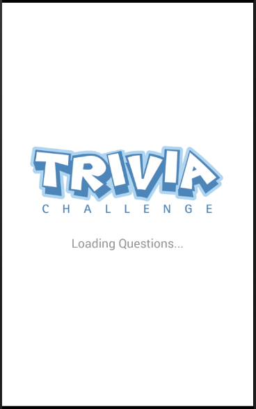
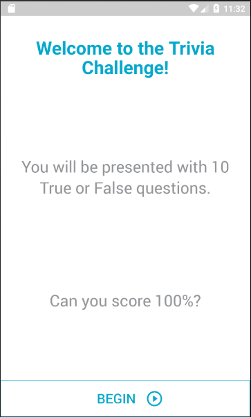
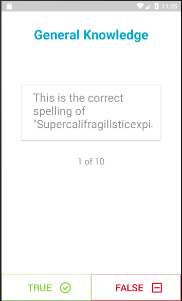
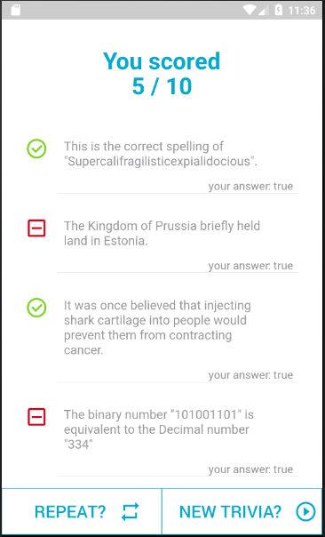

# React Native Trivia Game Sample

* [Overview](#overview)
* [Design](#design)
    * [Splash Screen](#splash-screen)
    * [Home Screen](#home-screen)
    * [Quiz Screen](#quiz-screen)
    * [Results Screen](#results-screen)
* [Setup](#setup)
    * [Android Requirements](#android-requirements)
    * [iOS Requirements](#ios-requirements)
    * [Running the project](#running-the-project)
    * [Debugging](#debugging)
* [Tech Specs](#tech-specs)
    * [Server](#server)
    * [State Management](#state-management)
    * [UI](#ui)
    * [Tests](#tests)
    * [Code Quality](#code-quality)
* [TO DO](#todo)    

## Overview

This is a simple true or false trivia app built with React Native + Redux to showcase a **suggested** project structure, base libraries and coding style (front-end only).


## Design

### Splash Screen:

Displayed while loading the questions (either from the server or the local storage whe using the `PersistorGate` component before rehydrate).



Disclaimer: Image taken from [here](http://www.madronaarms.com/news/2016/1/3/trivia-wednesday-nights-free-to-play)

### Home Screen:



* Static Text
* Display the total questions
* BEGIN button navigates to the Quiz screen and starts the Quiz

### Quiz Screen:



* The headline is from question category
* The card element contains the current question
* The next question should appear after the current question is answered True or False
* After all questions have been answered, navigate to the Results Screen

### Results screen:



* The Score shows correct and total
* Displays a list of the questions and whether the answer was correct or not
* Displays your answer so you can compare your results
* REPEAT starts over and navigates to the Home Screen with the same questions
* NEW TRIVIA starts over and navigates to the Home Screen with new questions pulled from the server

## Setup

* **Node v7.10.0** is recommended. If you use [NVM](https://github.com/creationix/nvm), you can run `nvm install 7.10.0` and `nvm use 7.10.0`.

* Install the React Native client globally `npm install -g react-native-cli`.

* Run `npm i` to install all project modules.

### Android Requirements

[SDK Tools](https://developer.android.com/studio/releases/sdk-tools.html) and SDK Build tools version **25.0.1** (recommended).

If you use [Android Studio](https://developer.android.com/studio/index.html), you can download and install the SDK and build tools under `Tools > Android > SDK manager`.

In order for the Android emulators to find the proper SDK you'll need to setup these environment variables either globally or on the run configuration:

* **ANDROID_HOME** i.e. C:\Users\super\AppData\Local\Android\Sdk
* **JAVA_HOME** i.e. C:\Program Files\Java\jdk1.8.0_131

### iOS Requirements

TDB

### Running the project

You can run the app by using either `react-native run-android` or `react-native run-ios` according to your target platform under the root project folder.

These scripts are available to run using either `npm run <script>` or `yarn run <script>`:

* `start` - Runs your app in development mode.
* `ios` - Like `start`, but also attempts to open your app in the iOS Simulator if you're on a Mac and have it installed.
* `android` - Like `start`, but also attempts to open your app on a connected Android device or emulator.
* `lint` - Runs linting checks.
* `test-only` - Runs all tests with coverage report.
* `test` - Runs all tests if linting checks pass.
* `test:watch` - Runs all tests in watch mode so every change on the tests source code triggers a new run.
* `test:update` - Runs all tests and updates snapshots.
* `typecheck` - Runs flow type safety checks
* `clean` - Runs `gradlew clean` for Android and cleans cache for when things get messy.

You can use the following options to run in **Android**:

* [Android Studio Emulator](https://developer.android.com/studio/run/emulator.html) - Install Android Studio and setup the emulator under `Tools > Android > AVD manager`
:blurb: You can create a direct shortcut to the emulator to avoid running Android Studio by pointing to `{USER_HOME}\AppData\Local\Android\sdk\tools\emulator.exe -avd {EMULATOR_NAME}`
* [Genymotion Emulator](https://www.genymotion.com/fun-zone/) - Make sure to use latest [VirtualBox](https://www.virtualbox.org/wiki/Downloads) version and to set the **Android SDK path** under the **Settings** menu.
* [Android (Real) Device](https://facebook.github.io/react-native/docs/running-on-device.html) - Enable USB debugging under `Settings > About phone > Build number (click 7 times) > Developer options > Enable USB debugging`. Connect the device via USB cable and run the app.
:bulb: You can check that your device is properly connecting to the ADB by running `adb devices`

You can use the following options to run in **iOS**:

* [xCode's Simulator](https://developer.apple.com/library/content/documentation/IDEs/Conceptual/iOS_Simulator_Guide/Introduction/Introduction.html)
* [iOS (Real) Device](https://facebook.github.io/react-native/docs/running-on-device.html)


### Debugging

Hitting `ctrl + m` while running the app on the Android emulator will display the Dev menu where you can select **Debug JS remotely** and enable **Live Reload** for faster changes refresh.

This will cause the debugger to open a new Chrome tab pointing to http://localhost:8081/debugger-ui/ and you can use the [Chrome Developer Tools](https://developer.chrome.com/devtools) to debug any Javascript directly connected to your app execution.

The standalone version of [React Developer Tools](https://github.com/facebook/react-devtools/tree/master/packages/react-devtools) can connect directly to the React Native execution to visualize each component (before rendering), its properties and updates. To use it, run `npm install -g react-devtools` and then `react-devtools`.

For other debugging options check the official [React Native's docs](https://facebook.github.io/react-native/docs/debugging.html)

`npm run test` runs linting and then all tests under the `__tests__` folder.

## Tech Specs

### Server

The api url is: https://opentdb.com/api.php?amount=10&difficulty=hard&type=boolean

Sample returned json:

```javascript
{
  "response_code": 0,
  "results": [
    {
      "category": "Entertainment: Video Games",
      "type": "boolean",
      "difficulty": "hard",
      "question": "Unturned originally started as a Roblox game.",
      "correct_answer": "True",
      "incorrect_answers": [
        "False"
      ]
    },…]}
```

### State Management

* [Redux](https://redux.js.org/docs/introduction/): The way to go for state management these days.
* [React Redux](https://github.com/reactjs/react-redux): Easy way to connect React components with Redux in a High Order Component style.
* [Redux persist](https://github.com/reactjs/redux): Local storage rehydration with [AsyncStorage](https://facebook.github.io/react-native/docs/asyncstorage.html) to avoid server calls when possible
* [Redux Thunk](https://github.com/gaearon/redux-thunk): Middleware to allow dispatching actions without passing redux all the way down the component tree.
* [Reselect](https://github.com/reactjs/reselect): Memoized selectors for Redux state to get calculated state without saving it to the store (e.g. the Results list).

### UI

* [React Navigation](https://reactnavigation.org/docs/intro/): Screen management with StackNavigator. Includes nav state management through a Redux reducer which reacts to regular actions to display the appropriate screen.
* [Native Base](https://docs.nativebase.io/): Base themming framework and enhanced React Native components. It provides CSS-like styling with nested classes but some specific inline styles are still used for convenience (`./src/styles/Styles.js`)

### Tests

Create test files under `./__tests__` to have the files loaded by jest.

Mocks and global test setup can be specified at `./__tests__/setup.js`.

* [Jest](https://facebook.github.io/jest/docs/en/getting-started.html): Main test framework with [Snapshot Testing](https://facebook.github.io/jest/docs/en/snapshot-testing.html#content) support to test React components.
* [Enzyme](http://airbnb.io/enzyme/docs/api/): Enhanced testing utilities for React including shallow rendering and event simulation. Snapshot serialization is automatically enhanced by `enzyme-to-json`.
* [Redux Mock Store](https://github.com/arnaudbenard/redux-mock-store): Fake the Redux store for tests.

### Code Quality

* [Babel](https://babeljs.io/docs/setup/): Javascript compiler to enable [ES6 / 7](https://github.com/lukehoban/es6features) features (async/await, destructuring, etc). This project uses `babel-preset-react-native-stage-0` preset. Babel config lives in `./.babelrc`
* [ESLint](https://eslint.org/docs/user-guide/getting-started): Suggests a coding style to keep it clean, maintainable and find issues before executing. This project uses `airbnb` preset (which includes React rules) plus the `react-native` and `flow-type` plugins. ESLint config lives in `./.eslintrc` 
* [Flow](https://flow.org/en/docs/react/): Static type checker to identify bugs during development.

## TODO

* Navigation Tests
* User Interaction Tests (button clicks, scroll, etc)
* Improve overall testing coverage
* Comprehensive flow type check
* Fix react-navigation exception when running screen tests